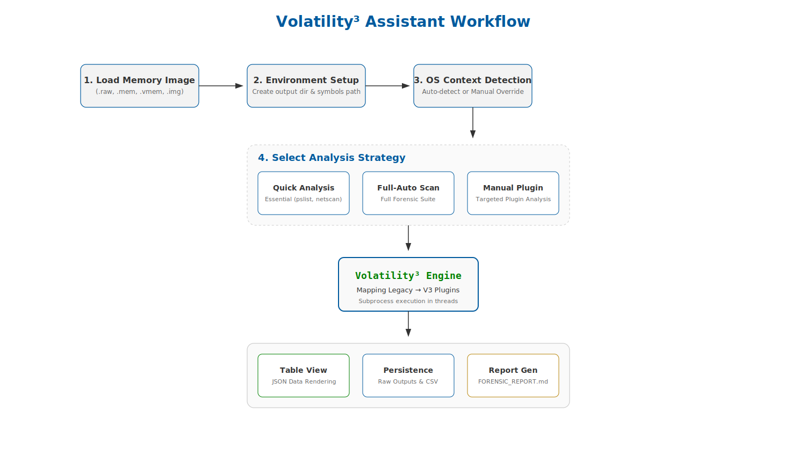
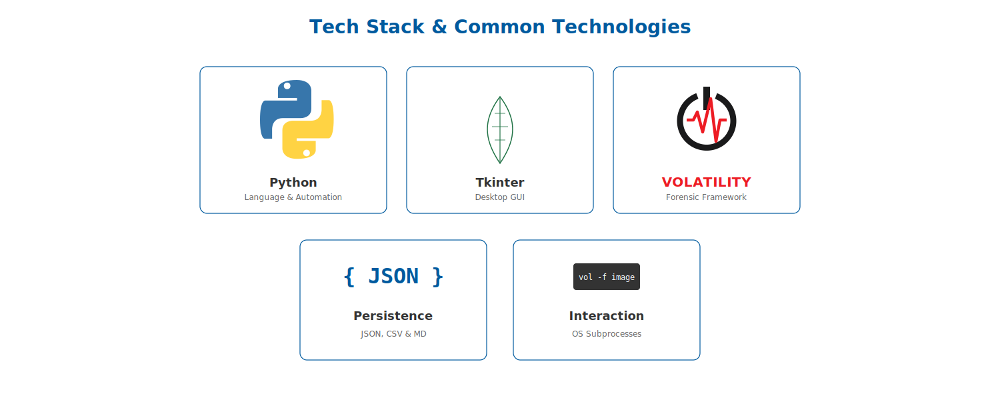

# Volatility³ Assistant GUI 🔍



## Technologies Used


A modern graphical user interface for the Volatility 3 Framework, designed to make memory forensics accessible and efficient.

## Features

- **Intuitive GUI**: Built with `tkinter`, replacing the complex CLI with a user-friendly window.
- **Plugin Categories**: Easily find and run plugins for Process, Network, Registry, and Security analysis.
- **Real-time Logging**: View plugin progress and output snippets directly in the application.
- **Automated OS Detection**: Quick detection of the operating system from memory images.
- **Quick Analysis**: One-click execution of essential forensic commands (info, pslist, netscan).
- **Result Persistence**: All outputs are automatically saved to timestamped directories for later review.

## Prerequisites

- **Python 3.x**
- **Volatility 3 Framework**: Must be installed and available in your system's PATH.
  ```bash
  pip install volatility3
  ```

## Usage

1. **Launch the tool**:
   ```bash
   python3 automation.py
   ```
2. **Browse** for a memory image file (`.raw`, `.mem`, `.img`, etc.).
3. **Detect OS** or jump straight to analysis.
4. **Select Plugins** from the tabs to perform specific forensic tasks.
5. **View Results** in the output log or check the generated `vol_gui_analysis_[timestamp]` folder.

## File Structure

- `automation.py`: The main application code.
- `README.md`: This documentation.
- `vol_gui_analysis_*/`: Automatically created folders containing detailed plugin outputs.

---
*Note: This tool is a wrapper for Volatility 3 and requires it to be functional on your system.*
